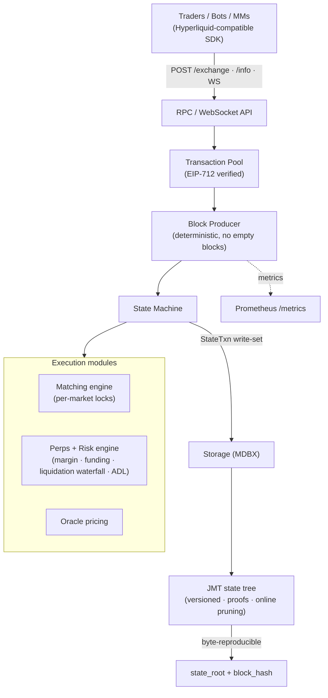

<!--
  kubera — GitHub organization profile.
  Lives in the repo `kubera-io/.github` at path `profile/README.md`.
  Visiting https://github.com/kubera-io renders this file.

  PLACEHOLDERS to fill with verified data are marked [[ … ]] and TODO comments.
  Do NOT ship unverifiable claims (audits, TVL, raise terms) until confirmed.
-->

  <!-- TODO: replace with real logo asset committed to this repo (e.g. ./profile/assets/kubera-logo.svg) -->
  

<h1 align="center">kubera</h1>

  <b>The open, verifiable perpetuals exchange stack.</b> 
  <b>开放、可验证的永续合约交易所技术栈。</b>

  <i>An open-source, self-hostable perp DEX — Hyperliquid-compatible, deterministic, and provable.</i> 
  <i>开源、可自托管的永续 DEX —— 兼容 Hyperliquid、确定性执行、状态可证明。</i>

  
  
  
  <!-- TODO: wire real CI badge once the public CI is green -->
  
  

  <a href="#-what-is-kubera--kubera-是什么">What</a> ·
  <a href="#-why-now--为什么是现在">Why now</a> ·
  <a href="#-what-makes-it-different--差异化">Edge</a> ·
  <a href="#-architecture--架构">Architecture</a> ·
  <a href="#-roadmap--路线图">Roadmap</a> ·
  <a href="#-status--现状">Status</a> ·
  <a href="#-contact--联系我们">Contact</a>

---

## 🪙 What is kubera / kubera 是什么

**EN —** kubera is building the open infrastructure for on-chain perpetual futures — the highest-volume product in crypto. Hyperliquid proved that a purpose-built, high-performance perp exchange can win enormous volume; kubera brings that architecture into the open: a **self-hostable, auditable, API-compatible** perpetuals chain that teams and institutions can run, verify, and extend themselves — without trusting a single closed operator.

**中文 —** kubera 致力于打造链上永续合约的开放基础设施 —— 永续合约是加密领域交易量最大的品类。Hyperliquid 证明了"专为永续打造的高性能交易所"能够赢得巨大交易量；kubera 把这套架构**开放化**:一条**可自托管、可审计、API 兼容**的永续合约链,让团队和机构能够自行运行、验证并扩展 —— 无需信任单一封闭运营方。

> **One line / 一句话:** *An open, provable Hyperliquid — perps infrastructure you can run and audit yourself.*
> *一个开放、可证明的 Hyperliquid —— 你能自己运行、自己审计的永续基础设施。*

---

## 📈 Why now / 为什么是现在

**EN**
- **Perps are crypto's largest market.** Perpetual futures dominate crypto trading volume, and on-chain perps are taking share from centralized venues at an accelerating rate.
- **The category leader is closed.** The leading on-chain perp venue is a closed, single-operator stack. There is no credibly-neutral, open, self-hostable equivalent — that is the gap kubera fills.
- **Institutions need verifiability.** Funds, market makers, and regulated venues increasingly require *provable* execution and solvency — not a black box. kubera is deterministic and state-provable by design.
- **Compatibility lowers the moat.** kubera speaks the same API and SDK as the incumbent, so existing bots, market-makers, and tooling work on day one — near-zero switching cost.

**中文**
- **永续是加密最大的市场。** 永续合约占据加密交易量的主导地位,链上永续正以加速度从中心化场所抢占份额。
- **品类龙头是封闭的。** 当前领先的链上永续场所是封闭、单一运营方的技术栈。市场上**缺少**一个可信中立、开放、可自托管的同类产品 —— 这正是 kubera 要填补的空白。
- **机构需要可验证性。** 基金、做市商与合规场所越来越要求**可证明**的执行与偿付能力,而非黑箱。kubera 从设计上即是确定性、状态可证明的。
- **兼容性降低迁移壁垒。** kubera 使用与现有龙头相同的 API 与 SDK,现有量化机器人、做市商与工具**开箱即用** —— 迁移成本近乎为零。

<!-- TODO: add verified market figures here (e.g. on-chain perp daily volume, category TAM) with sources. Avoid unsourced numbers. -->

---

## ⚡ What makes it different / 差异化

| | **EN** | **中文** |
|---|---|---|
| 🔌 **Hyperliquid-compatible** | Drop-in compatible with the Hyperliquid API and Rust SDK — verified by a conformance test where the *real* upstream SDK signs orders/transfers that the node accepts. Existing tooling just works. | 与 Hyperliquid API 和 Rust SDK 直接兼容 —— 由一致性测试验证:**真实**上游 SDK 签出的下单/转账,节点照单全收。现有工具无缝接入。 |
| 🔍 **Verifiable & deterministic** | Byte-reproducible state roots, Merkle state proofs (JMT), and fixed-point math with **no floats in consensus**. Anyone can replay history and verify every block. | 字节级可复现的状态根、Merkle 状态证明(JMT)、定点数运算且**共识层无浮点**。任何人都能重放历史、验证每个区块。 |
| 🛡️ **Institutional-grade risk engine** | Full liquidation waterfall — maintenance margin → insurance fund → auto-deleveraging (ADL). No production perp venue forgives bad debt; neither does kubera. Solvency is enforced and provable. | 完整清算瀑布 —— 维持保证金 → 保险基金 → 自动减仓(ADL)。没有任何正经永续场所会无偿赦免坏账,kubera 也不会。偿付能力被强制执行且可证明。 |
| 🔒 **Money can't leak** | A per-block conservation invariant proves USDC is neither created nor destroyed (fees → insurance fund, bad debt socialized correctly). Two real accounting bugs were caught and fixed *by this check*. | 逐块守恒不变量证明 USDC 不被凭空创造或销毁(手续费→保险基金、坏账正确社会化)。**正是这套检查**发现并修复了两个真实记账 bug。 |
| 🧱 **Engineered to not break** | Crash-transparent recovery (a recovered node is byte-identical to one that never crashed), concurrency proven deadlock-free with **loom**, property-based fuzzing, golden determinism tests, and a hard CI gate (`fmt` + `clippy -D warnings` + full tests + loom). | 崩溃透明恢复(恢复后的节点与从未崩溃的节点逐字节一致)、用 **loom** 证明并发无死锁、属性化 fuzz、黄金确定性测试,以及硬性 CI 门禁(`fmt` + `clippy -D warnings` + 全量测试 + loom)。 |
| 🪶 **Self-hostable** | A single Rust binary: matching, perps, risk, storage, and an HTTP/WS API. Run it locally, in your VPC, or as a managed service. | 单个 Rust 二进制:撮合、永续、风控、存储、HTTP/WS API 一体。可本地、可私有云、可托管运行。 |

---

## 🏗️ Architecture / 架构

**EN —** kubera is a deterministic state machine over a versioned Merkle store. Every write flows through one commit path, producing a reproducible state root; the matching engine, perps/risk engine, and oracle are modules over that machine.

**中文 —** kubera 是一台运行在版本化 Merkle 存储之上的确定性状态机。所有写入经由单一 commit 路径,产出可复现的状态根;撮合引擎、永续/风控引擎、预言机都是这台状态机之上的模块。

EN: Crates — primitives · crypto · jmt · storage · execution · transaction-pool · rpc · node (+ consensus / network / visor for the multi-node roadmap).
中文:模块 —— primitives · crypto · jmt · storage · execution · transaction-pool · rpc · node(+ 面向多节点路线的 consensus / network / visor)。

---

## 🗺️ Roadmap / 路线图

| Phase | **EN** | **中文** | Status |
|---|---|---|---|
| **P1 — Single-node chain** | Self-hostable perp DEX: HL-compatible API, deterministic execution, persistent JMT state, liquidation waterfall + insurance fund + ADL, crash recovery, observability, hard CI. | 可自托管的永续 DEX:HL 兼容 API、确定性执行、持久化 JMT 状态、清算瀑布+保险基金+ADL、崩溃恢复、可观测性、硬 CI。 | ✅ **Built** / 已完成 |
| **P2 — Multi-node consensus** | BFT consensus (HotStuff-family integration is designed), P2P gossip, block sync, multi-validator finality. | BFT 共识(HotStuff 系集成方案已设计)、P2P gossip、区块同步、多验证者最终性。 | 🛠️ **Designed → in progress** / 已设计·推进中 |
| **P3 — Markets & liquidity** | Spot markets, HLP-style liquidity vaults, richer order types, cross-margin products. | 现货市场、HLP 式流动性金库、更丰富的订单类型、全仓产品。 | 🔭 **Planned** / 规划中 |
| **P4 — Network & mainnet** | Production bridge, oracle committee, validator set, testnet → mainnet, governance. | 生产级桥、预言机委员会、验证者集合、测试网→主网、治理。 | 🔭 **Planned** / 规划中 |

<!-- TODO: add target dates/quarters once committed. Investors want timelines. -->

---

## ✅ Status / 现状

**EN —** P1 is built and self-verifying: the single-node chain runs end-to-end (submit → pool → produce → execute → persist → query), with a hard CI gate (rustfmt, clippy `-D warnings`, full test suite, loom concurrency model). Test coverage spans unit, integration, golden-determinism, property-based fuzzing, crash-recovery, and Hyperliquid-SDK conformance.

**中文 —** P1 已完成且自校验:单节点链端到端跑通(提交→交易池→出块→执行→持久化→查询),并有硬性 CI 门禁(rustfmt、clippy `-D warnings`、全量测试、loom 并发模型)。测试覆盖单元、集成、黄金确定性、属性化 fuzz、崩溃恢复,以及 Hyperliquid SDK 一致性。

<!-- TODO: replace with verified traction once available: testnet live, partners, design partners, LOIs, audit status. Do NOT claim an audit until one exists. -->

---

## 💼 For investors / 致投资人

**EN —** kubera is positioned as the open, credibly-neutral counterpart to the leading closed perp venue — capturing the same demand (the largest market in crypto) with a model the incumbent can't: **open, self-hostable, and verifiable**, with **drop-in compatibility** that makes the entire existing ecosystem of bots and market-makers addressable from day one.

**中文 —** kubera 的定位,是当前领先封闭永续场所的"开放、可信中立"对位者 —— 承接同样的需求(加密最大的市场),却采用龙头无法采用的模式:**开放、可自托管、可验证**,并以**无缝兼容**让现有全部机器人与做市商生态从第一天起即可触达。

<!-- TODO (you provide; keep honest): -->
<!-- - Team / 团队: founders & key hires with track record -->
<!-- - Raise / 融资: stage, amount, use of funds -->
<!-- - Backers / 投资人: only if confirmed -->
<!-- - Metrics / 指标: testnet usage, design partners, pipeline -->

---

## 📦 Repositories / 代码仓库

<!-- TODO: pin the public repos on the org page and link them here -->
- **`chain`** — the single-node perpetuals chain (P1). / 单节点永续链(P1)。
- **`perp-engine`** — perps core / math / risk / types. / 永续核心/数学/风控/类型。
<!-- - add more as they go public -->

---

## 📬 Contact / 联系我们

**EN —** Building in the open. For partnerships, market-making, or investment:
**中文 —** 我们开放共建。商务合作、做市或投资请联系:

- 📧 **[[ contact@kubera.xyz ]]** <!-- TODO: real email -->
- 🐦 **[[ @kubera_xyz ]]** <!-- TODO: real handle / X -->
- 🌐 **[[ kubera.xyz ]]** <!-- TODO: real site -->

© kubera-io · Building open perpetuals infrastructure / 共建开放永续基础设施

