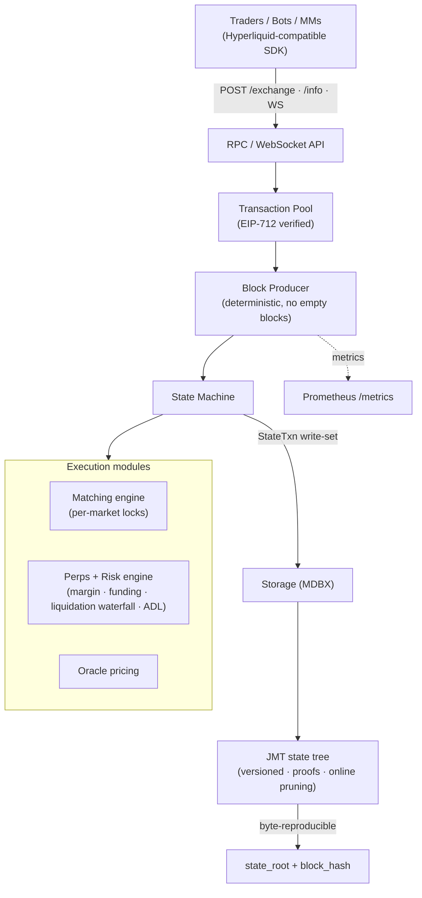

<!--
  Kubera — GitHub organization profile (English).
  Lives in the repo `kubera-io/.github` at path `profile/README.md`.
  Visiting https://github.com/kubera-io renders this file.
  Chinese version: profile/README.zh-CN.md

  PLACEHOLDERS to fill with verified data are marked [[ … ]] and TODO comments.
  Do NOT ship unverifiable claims (audits, TVL, raise terms) until confirmed.
-->

  <!-- TODO: replace with the final logo asset (e.g. ./assets/Kubera-logo.svg) -->
  

<h1 align="center">Kubera</h1>

  <b>The open, verifiable perpetuals exchange stack.</b> 
  <i>An open-source, self-hostable perp DEX — Hyperliquid-compatible, deterministic, and provable.</i>

  <a href="./README.zh-CN.md">🌐 中文版 / Read in Chinese</a>

  
  
  
  
  

  <a href="#-what-is-kubera">What</a> ·
  <a href="#-why-now">Why now</a> ·
  <a href="#-what-makes-it-different">Edge</a> ·
  <a href="#-architecture">Architecture</a> ·
  <a href="#-roadmap">Roadmap</a> ·
  <a href="#-status">Status</a> ·
  <a href="#-contact">Contact</a>

---

## 🪙 What is Kubera

Kubera is building the open infrastructure for on-chain perpetual futures — the highest-volume product in crypto. Hyperliquid proved that a purpose-built, high-performance perp exchange can win enormous volume; Kubera brings that architecture into the open: a **self-hostable, auditable, API-compatible** perpetuals chain that teams and institutions can run, verify, and extend themselves — without trusting a single closed operator.

> **In one line:** *An open, provable Hyperliquid — perps infrastructure you can run and audit yourself.*

---

## 📈 Why now

- **Perps are crypto's largest market.** Perpetual futures dominate crypto trading volume, and on-chain perps are taking share from centralized venues at an accelerating rate.
- **The category leader is closed.** The leading on-chain perp venue is a closed, single-operator stack. There is no credibly-neutral, open, self-hostable equivalent — that is the gap Kubera fills.
- **Institutions need verifiability.** Funds, market makers, and regulated venues increasingly require *provable* execution and solvency — not a black box. Kubera is deterministic and state-provable by design.
- **Compatibility lowers the moat.** Kubera speaks the same API and SDK as the incumbent, so existing bots, market-makers, and tooling work on day one — near-zero switching cost.

<!-- TODO: add verified market figures here (on-chain perp daily volume, category TAM) with sources. Avoid unsourced numbers. -->

---

## ⚡ What makes it different

| | |
|---|---|
| 🔌 **Hyperliquid-compatible** | Drop-in compatible with the Hyperliquid API and Rust SDK — verified by a conformance test where the *real* upstream SDK signs orders/transfers that the node accepts. Existing tooling just works. |
| 🔍 **Verifiable & deterministic** | Byte-reproducible state roots, Merkle state proofs (JMT), and fixed-point math with **no floats in consensus**. Anyone can replay history and verify every block. |
| 🛡️ **Institutional-grade risk engine** | Full liquidation waterfall — maintenance margin → insurance fund → auto-deleveraging (ADL). No production perp venue forgives bad debt; neither does Kubera. Solvency is enforced and provable. |
| 🔒 **Money can't leak** | A per-block conservation invariant proves USDC is neither created nor destroyed (fees → insurance fund, bad debt socialized correctly). Two real accounting bugs were caught and fixed *by this check*. |
| 🧱 **Engineered to not break** | Crash-transparent recovery (a recovered node is byte-identical to one that never crashed), concurrency proven deadlock-free with **loom**, property-based fuzzing, golden determinism tests, and a hard CI gate (`fmt` + `clippy -D warnings` + full tests + loom). |
| 🪶 **Self-hostable** | A single Rust binary: matching, perps, risk, storage, and an HTTP/WS API. Run it locally, in your VPC, or as a managed service. |

---

## 🏗️ Architecture

Kubera is a deterministic state machine over a versioned Merkle store. Every write flows through one commit path, producing a reproducible state root; the matching engine, perps/risk engine, and oracle are modules over that machine.

Crates — primitives · crypto · jmt · storage · execution · transaction-pool · rpc · node (+ consensus / network / visor for the multi-node roadmap).

---

## 🗺️ Roadmap

| Phase | Scope | Status |
|---|---|---|
| **P1 — Single-node chain** | Self-hostable perp DEX: HL-compatible API, deterministic execution, persistent JMT state, liquidation waterfall + insurance fund + ADL, crash recovery, observability, hard CI. | ✅ **Built** |
| **P2 — Multi-node consensus** | BFT consensus (HotStuff-family integration is designed), P2P gossip, block sync, multi-validator finality. | 🛠️ **Designed → in progress** |
| **P3 — Markets & liquidity** | Spot markets, HLP-style liquidity vaults, richer order types, cross-margin products. | 🔭 **Planned** |
| **P4 — Network & mainnet** | Production bridge, oracle committee, validator set, testnet → mainnet, governance. | 🔭 **Planned** |

<!-- TODO: add target dates/quarters once committed. Investors want timelines. -->

---

## ✅ Status

P1 is built and self-verifying: the single-node chain runs end-to-end (submit → pool → produce → execute → persist → query), with a hard CI gate (rustfmt, clippy `-D warnings`, full test suite, loom concurrency model). Test coverage spans unit, integration, golden-determinism, property-based fuzzing, crash-recovery, and Hyperliquid-SDK conformance.

<!-- TODO: replace with verified traction once available: testnet live, partners, design partners, LOIs, audit status. Do NOT claim an audit until one exists. -->

---

## 💼 For investors

Kubera is positioned as the open, credibly-neutral counterpart to the leading closed perp venue — capturing the same demand (the largest market in crypto) with a model the incumbent can't: **open, self-hostable, and verifiable**, with **drop-in compatibility** that makes the entire existing ecosystem of bots and market-makers addressable from day one.

<!-- TODO (you provide; keep honest): -->
<!-- - Team: founders & key hires with track record -->
<!-- - Raise: stage, amount, use of funds -->
<!-- - Backers: only if confirmed -->
<!-- - Metrics: testnet usage, design partners, pipeline -->

---

## 📦 Repositories

<!-- TODO: pin the public repos on the org page and link them here -->
- **`chain`** — the single-node perpetuals chain (P1).
- **`perp-engine`** — perps core / math / risk / types.
<!-- - add more as they go public -->

---

## 📬 Contact

Building in the open. For partnerships, market-making, or investment:

- 📧 **[[ contact@kubera.xyz ]]** <!-- TODO: real email -->
- 🐦 **[[ @kubera_xyz ]]** <!-- TODO: real handle / X -->
- 🌐 **[[ kubera.xyz ]]** <!-- TODO: real site -->

© Kubera · Building open perpetuals infrastructure · <a href="./README.zh-CN.md">中文</a>

