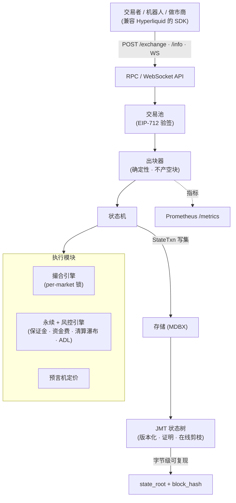

<!--
  Kubera —— 组织介绍页(中文版)。
  与英文版 profile/README.md 对应,放在同一目录,随 profile/ 一起推送到 kubera-io/.github。
  [[ … ]] 为待填占位;未经核实的内容(审计、TVL、融资条款)请勿对外发布。
-->

  

<h1 align="center">Kubera</h1>

  <b>开放、可验证的永续合约交易所技术栈。</b> 
  <i>开源、可自托管的永续 DEX —— 兼容 Hyperliquid、确定性执行、状态可证明。</i>

  <a href="./README.md">🌐 English / 英文版</a>

  
  
  
  

---

## 🪙 Kubera 是什么

Kubera 致力于打造链上永续合约的开放基础设施 —— 永续合约是加密领域交易量最大的品类。Hyperliquid 证明了"专为永续打造的高性能交易所"能够赢得巨大交易量;Kubera 把这套架构**开放化**:一条**可自托管、可审计、API 兼容**的永续合约链,让团队和机构能够自行运行、验证并扩展 —— 无需信任单一封闭运营方。

> **一句话:** *一个开放、可证明的 Hyperliquid —— 你能自己运行、自己审计的永续基础设施。*

---

## 📈 为什么是现在

- **永续是加密最大的市场。** 永续合约占据加密交易量的主导地位,链上永续正以加速度从中心化场所抢占份额。
- **品类龙头是封闭的。** 当前领先的链上永续场所是封闭、单一运营方的技术栈。市场上缺少可信中立、开放、可自托管的同类产品 —— 这正是 Kubera 要填补的空白。
- **机构需要可验证性。** 基金、做市商与合规场所越来越要求**可证明**的执行与偿付能力,而非黑箱。Kubera 从设计上即是确定性、状态可证明的。
- **兼容性降低迁移壁垒。** Kubera 使用与现有龙头相同的 API 与 SDK,现有量化机器人、做市商与工具**开箱即用** —— 迁移成本近乎为零。

<!-- TODO: 补充带来源的市场数字(链上永续日交易量、品类 TAM),不要用无出处数字。 -->

---

## ⚡ 差异化

| | |
|---|---|
| 🔌 **兼容 Hyperliquid** | 与 Hyperliquid API 和 Rust SDK 直接兼容 —— 由一致性测试验证:**真实**上游 SDK 签出的下单/转账,节点照单全收。现有工具无缝接入。 |
| 🔍 **可验证 · 确定性** | 字节级可复现的状态根、Merkle 状态证明(JMT)、定点数运算且**共识层无浮点**。任何人都能重放历史、验证每个区块。 |
| 🛡️ **机构级风控引擎** | 完整清算瀑布 —— 维持保证金 → 保险基金 → 自动减仓(ADL)。没有任何正经永续场所会无偿赦免坏账,Kubera 也不会。偿付能力被强制执行且可证明。 |
| 🔒 **资金不会泄漏** | 逐块守恒不变量证明 USDC 不被凭空创造或销毁(手续费→保险基金、坏账正确社会化)。**正是这套检查**发现并修复了两个真实记账 bug。 |
| 🧱 **为"不出故障"而设计** | 崩溃透明恢复(恢复后的节点与从未崩溃的节点逐字节一致)、用 **loom** 证明并发无死锁、属性化 fuzz、黄金确定性测试,以及硬性 CI 门禁(`fmt` + `clippy -D warnings` + 全量测试 + loom)。 |
| 🪶 **可自托管** | 单个 Rust 二进制:撮合、永续、风控、存储、HTTP/WS API 一体。可本地、私有云或托管运行。 |

---

## 🏗️ 架构

Kubera 是一台运行在版本化 Merkle 存储之上的确定性状态机。所有写入经由单一 commit 路径,产出可复现的状态根;撮合引擎、永续/风控引擎、预言机都是这台状态机之上的模块。

模块 —— primitives · crypto · jmt · storage · execution · transaction-pool · rpc · node(+ 面向多节点路线的 consensus / network / visor)。

---

## 🗺️ 路线图

| 阶段 | 范围 | 状态 |
|---|---|---|
| **P1 —— 单节点链** | 可自托管的永续 DEX:HL 兼容 API、确定性执行、持久化 JMT 状态、清算瀑布+保险基金+ADL、崩溃恢复、可观测性、硬 CI。 | ✅ **已完成** |
| **P2 —— 多节点共识** | BFT 共识(HotStuff 系集成方案已设计)、P2P gossip、区块同步、多验证者最终性。 | 🛠️ **已设计 · 推进中** |
| **P3 —— 市场与流动性** | 现货市场、HLP 式流动性金库、更丰富订单类型、全仓产品。 | 🔭 **规划中** |
| **P4 —— 网络与主网** | 生产级桥、预言机委员会、验证者集合、测试网→主网、治理。 | 🔭 **规划中** |

<!-- TODO: 确定后补上时间节点/季度;投资人关注时间线。 -->

---

## ✅ 现状

P1 已完成且自校验:单节点链端到端跑通(提交→交易池→出块→执行→持久化→查询),并有硬性 CI 门禁(rustfmt、clippy `-D warnings`、全量测试、loom 并发模型)。测试覆盖单元、集成、黄金确定性、属性化 fuzz、崩溃恢复,以及 Hyperliquid SDK 一致性。

<!-- TODO: 替换为已核实的进展(测试网上线、合作方、设计伙伴、LOI、审计状态)。未审计前请勿声称"已审计"。 -->

---

## 💼 致投资人

Kubera 的定位,是当前领先封闭永续场所的"开放、可信中立"对位者 —— 承接同样的需求(加密最大的市场),却采用龙头无法采用的模式:**开放、可自托管、可验证**,并以**无缝兼容**让现有全部机器人与做市商生态从第一天起即可触达。

---

## 📦 代码仓库

- **`chain`** —— 单节点永续链(P1)。
- **`perp-engine`** —— 永续核心/数学/风控/类型。

---

## 📬 联系我们

我们开放共建。商务合作、做市或投资请联系:

- 📧 **[[ contact@kubera.xyz ]]**
- 🐦 **[[ @kubera_xyz ]]**
- 🌐 **[[ kubera.xyz ]]**

© Kubera · 共建开放永续基础设施 · <a href="./README.md">English</a>

